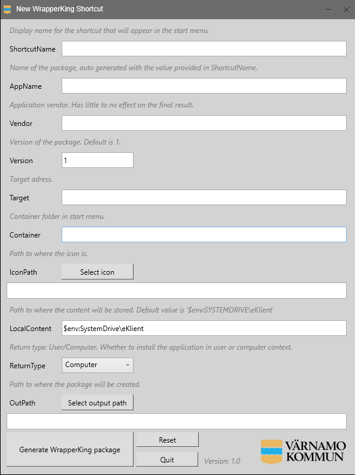

<a name="readme-top"></a>

<!-- PROJECT LOGO -->
<br />
<div align="center">
  <a href="https://github.com/Varnamo-kommun/New-WKShortcut">
    
  </a>

<h3 align="center">New WrapperKing Shortcut</h3>

  <p align="center">
    This little tool will help you create shortcuts for deployment in SysMan in a consistent way.
    <br />
    <br />
    <a href="https://github.com/Varnamo-kommun/New-WKShortcut">View Demo</a>
    ·
    <a href="https://github.com/Varnamo-kommun/New-WKShortcut/issues/new?labels=bug&template=bug-report---.md">Report Bug</a>
    ·
    <a href="https://github.com/Varnamo-kommun/New-WKShortcut/issues/new?labels=enhancement&template=feature-request---.md">Request Feature</a>
  </p>
</div>


<!-- TABLE OF CONTENTS -->
## Table of Contents

- [Table of Contents](#table-of-contents)
- [About The Project](#about-the-project)
  - [Built With](#built-with)
- [Getting Started](#getting-started)
  - [Prerequisites](#prerequisites)
  - [Installation](#installation)
- [Changelog](#changelog)
- [Roadmap](#roadmap)
- [Acknowledgements](#acknowledgements)


<!-- ABOUT THE PROJECT -->
## About The Project
In our organisation we have a lot of web applications. Migrating to eKlient and starting to utilize the powerful WrapperKing to package applications we found that it took a lot of time and with multiple persons handling the application packaging, there where sometimes disparities in how they performed - Hence, this application!


### Built With

* [Powershell](https://docs.microsoft.com/en-us/powershell/)
* [VSCode](https://code.visualstudio.com/)
* [WrapperKing](https://www.inera.se/tjanster/alla-tjanster-a-o/e-klient)


<!-- GETTING STARTED -->
## Getting Started

### Prerequisites

This is an example of how to list things you need to use the software and how to install them.
* WrapperKing
  ```sh
  Download and install WrapperKing from DownloadManager
  ```

### Installation

1. Clone the repo
   ```sh
   Clone this repo and run New-WKShortcut.ps1
   ```

## Changelog

`New-WKShortcut` is currently only maintained by one person. New features might take a while.
- Version 1.0 - 2024-04-18
  - [x] Repository made public
<!-- USAGE EXAMPLES -->

<!-- ROADMAP -->
## Roadmap

 - [ ] Adding compability for cli based package generation (bulk)


<!-- ACKNOWLEDGEMENTS -->
## Acknowledgements
eKlient team for the powerful WrapperKing application packager [eKlient](https://www.inera.se/tjanster/alla-tjanster-a-o/e-klient)